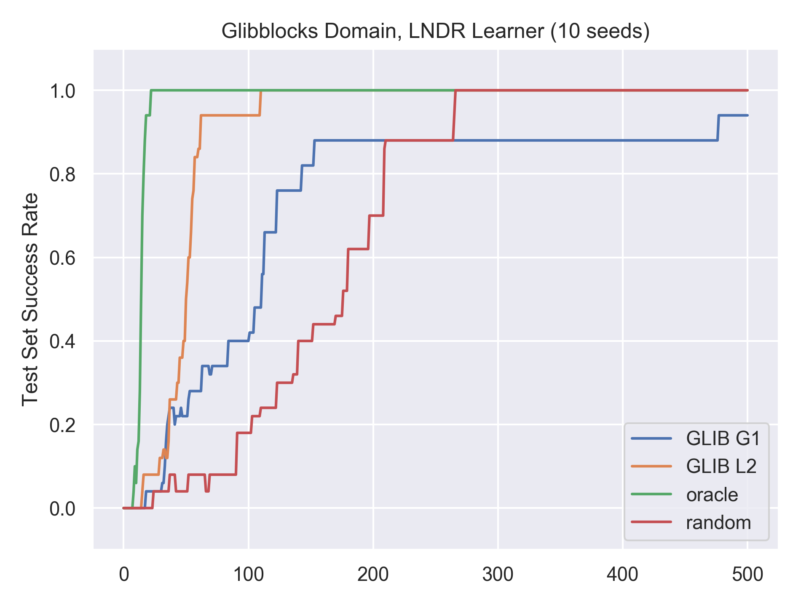
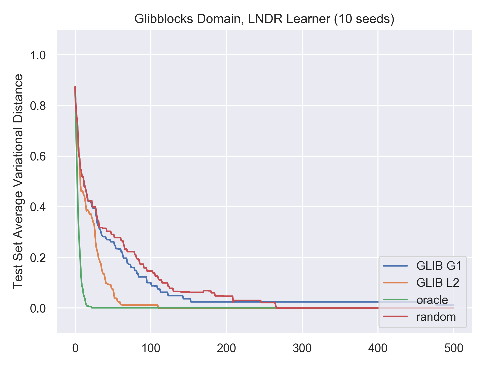

This repository houses code for the AAAI 2021 paper:

GLIB: Efficient Exploration for Relational Model-Based Reinforcement Learning via Goal-Literal Babbling

Rohan Chitnis*, Tom Silver*, Joshua Tenenbaum, Leslie Pack Kaelbling, Tomás Lozano-Pérez.

For any questions or issues with the code, please email <ronuchit@mit.edu> and <tslvr@mit.edu>.

Link to paper: https://arxiv.org/abs/2001.08299

Instructions for running:
* Use Python 3.5 or higher, e.g. with a virtual environment.
* Download Python dependencies: `pip install -r requirements.txt`.
* Download the Fast-Forward (FF) planner to any location on your computer.
-> Linux: https://fai.cs.uni-saarland.de/hoffmann/ff/FF-v2.3.tgz
-> Mac: https://github.com/ronuchit/FF
* From the FF directory you just created, run `make` to build FF, producing the executable `ff`.
* Create an environment variable "FF_PATH" pointing to this `ff` executable.
* Back in the GLIB directory, you can now run `python main.py`.

By default, the code runs GLIB-L, GLIB-G, Oracle, and Action babbling (also called "random") on the Blocks domain. If you want another domain or only some of the methods, change `domain_name` or `curiosity_methods_to_run` in `settings.py`. Plots will get written out after each seed into an automatically created `results/` folder. Here is an example of the rough shape of plots that should result from running this code out-of-the-box (it may take around 15 minutes to complete):

